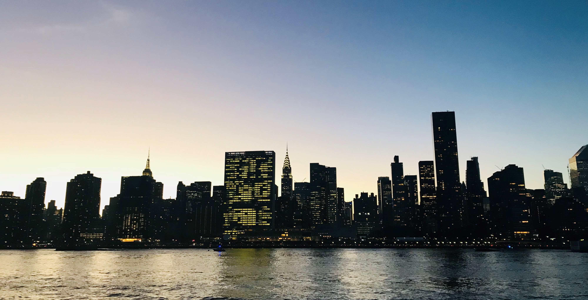

#### Epidemiologist-in-Training | New New Yorker

  

Navigating life in NYC can be hard---especially for a small-town Southern twenty-something like me---but it's all part of my journey to success. Juggling a hectic schedule as both a student and employee at Columbia,  I've found that New York is home to an abundance of opportunities for adventure---academic or otherwise---that are sure to satisfy my inquisitive appetite for years to come. 

 

